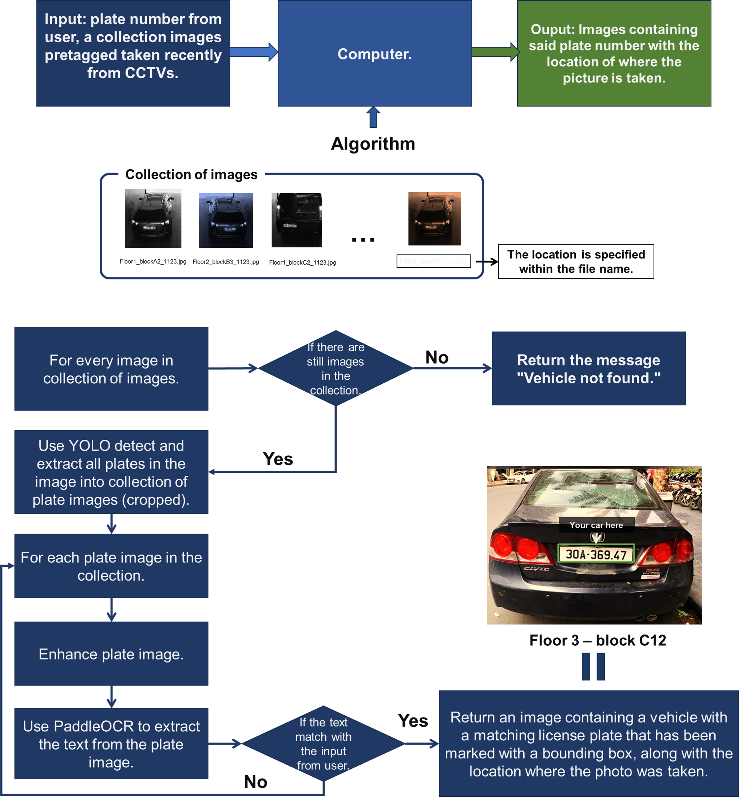
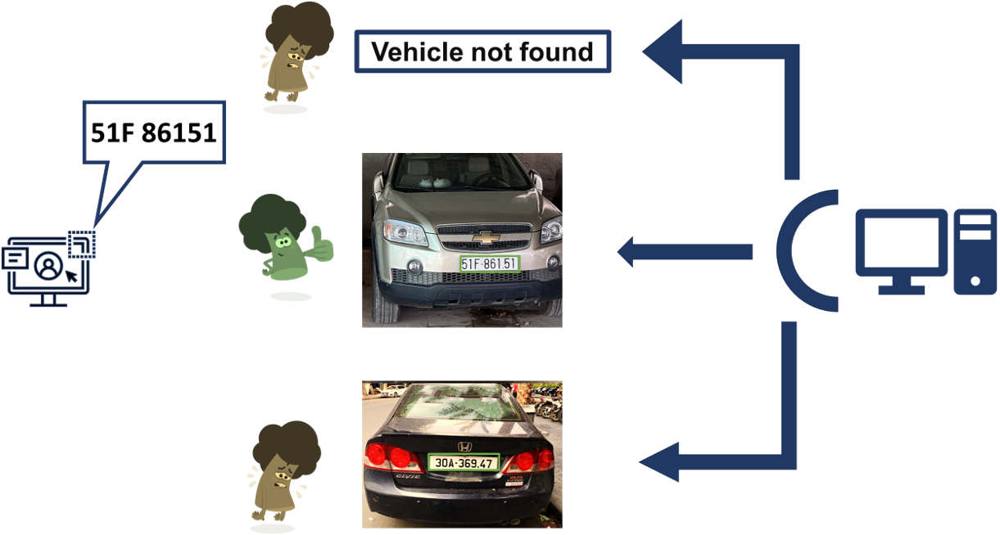

# **Vehicle search**

<p align="middle">
  
  
</p>

---
## **Table of content**
|**Section**| 
|:---:| 
|[Description](#description)|
|[Algorithm](#algorithm)|
|[Quick Start](#quickstart)| 
|[Evalutation](#evaluation)| 

##

## Description
Finding a specific vehicle in large parking areas can be a daunting task. To address this challenge, a solution utilizing license plate recognition technology has been developed. By inputting their plate number, users can quickly locate their parked cars using advanced computer vision algorithms. This innovative approach simplifies the process, eliminates manual searching, and saves time, providing a mean of finding cars in busy parking environments convenient.
Vehicle search is application help you find vehicle by license plate.
> This project based on [YOLOv8](https://github.com/ultralytics/ultralytics) and [PaddleOCR](https://github.com/PaddlePaddle/PaddleOCR). 

## Algorithm


## Quickstart 

First, clone this repo.

```console
cd Vehicle_search
git clone https://github.com/4ursmile/Vehicle_search
```

> I suggest using python 3.10.

### Setup enviroment.

PaddlePaddle enviroment reference  [here](https://github.com/PaddlePaddle/PaddleOCR/blob/release/2.6/doc/doc_en/quickstart_en.md)

* If you have CUDA 9 or CUDA 10 installed on your machine, please run the following command to install

```console
python -m pip install paddlepaddle-gpu -i https://pypi.tuna.tsinghua.edu.cn/simple
```
* If you have no available GPU on your machine, please run the following command to install the CPU version
```console
python -m pip install paddlepaddle -i https://pypi.tuna.tsinghua.edu.cn/simple
```

### install requirement package.

```console
pip install -r requirements.txt
```

Now it's your C: 

To run application please run follow command:
```Console
streamlit run main.py
```
## Evaluation



<p align="middle">

</p>
<h2 align="middle"><b>Thank you!</b></h2 >
